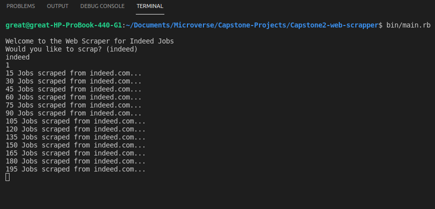
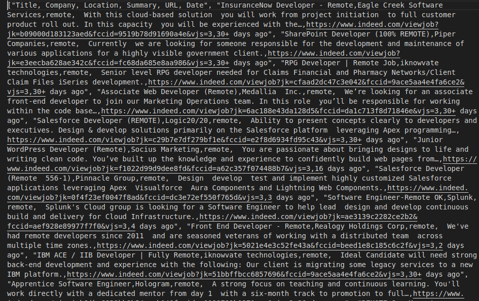

# Web Scraping using Nokogiri and HTTparty

## Definition of The Project

This project is all about web scraping, geting data or information from a website.

## About Project

The purpose of this project is to develop a scraper tool to achieve web-scraping. This was achieved using Ruby, HTTparty and Nokogiri gem.

- Nokogiri is an HTML, XML, SAX, and Reader parser.

- The above Ruby Gems can be sources from [Ruby Gems](https://rubygems.org/)

In this project, I created a scraper which extracts available remote jobs at (<https://www.indeed.com>)

## Preview

## Built With

- Rubocop
- Ruby
- HTTparty
- Nokogiri
- RSpec

## Getting Started

To get started, you should first clone this file in your local machine.
`
git clone https://github.com/Aduda-Boaz/Capstone2-web-scrapper
`

## Prerequisites

    Ruby installed on local machine
    Text editor (preferably: VSCode, Atom, Sublime)
    Git
    Chrome Browser

## Setup

   If you have installed `Ruby` on your machine:

   1. Clone the project into your local machine using `git clone` command or download the zip file.
   2. Go into the project directory using `cd directory name` command.
   3. Install required gems by using  `bundle`
    - gem install httpart
    - gem install nokogiri
    - gem install rspec
    - gem install pp

   4. From the root directory type `ruby bin/main.rb` command.
   5. Give the project sometime to load then you will be able to see the results in your terminal. Enjoy the scraping as well as in the .csv file created at the root folder.
   6. Run command `rspec`  to test the various methods in the classes.

## Contributing

Contributions, issues and feature requests are welcome!
You can do the following:

    1. Fork the project
    2. Clone the project to your local machine
    3. cd into the project directory
    4. Run git checkout -b your-branch-name
    5. Make your contributions
    6. Push your branch up to your forked repository
    7. Open a Pull Request with a detailed description to the development branch of the original project for a review

Please feel free to contribute to any of these!

Feel free to check the [issues page](https://github.com/Aduda-Boaz/Capstone2-web-scrapper/issues).

## Author

👤 **Boaz Aduda**

- Github: [@Aduda-Boaz](https://github.com/Aduda-Boaz)
- Twitter: [@BoazAduda](https://twitter.com/BoazAduda)

## Show your support

Give a :star2: if you like this project! :blush:
